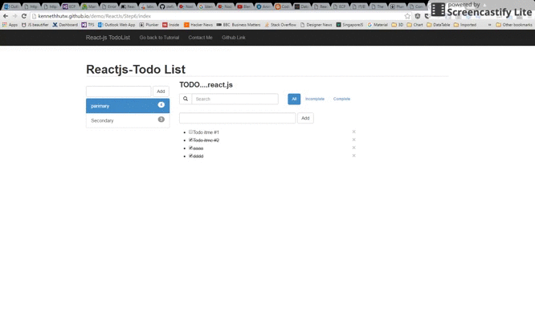

# React-js-todolist
React-js-todolist

The Github Repo of Multiple Sortable Todos using React-js.

1. ##Tutorial##
	简体中文版本
	- [Building a Todo app with React.js (1) - A simple todos list ](http://kennethhutw.github.io/2016/07/21/React-js-todo-list-sortable-cn-1/) 
	- [Building a Todo app with React.js (2) - Improve Component & Remove Component](http://kennethhutw.github.io/2016/07/21/React-js-todo-list-sortable-cn-2/)
	- [Building a Todo app with React.js (3) - Adding Filters for Search and showing complete/incompleted tasks](http://kennethhutw.github.io/2016/07/21/React-js-todo-list-sortable-cn-3/)
	- [Building a Todo app with React.js (4) - Multiple Todos](http://kennethhutw.github.io/2016/07/21/React-js-todo-list-sortable-cn-4/)
	- [Building a Todo app with React.js (5) - Sort item](http://kennethhutw.github.io/2016/07/21/React-js-todo-list-sortable-cn-5/)
	
	繁體中文版本
	- [Building a Todo app with React.js (1) - A simple todos list ](http://kennethhutw.github.io/2016/08/18/React-js-todo-list-sortable-tw-1/) 
	- [Building a Todo app with React.js (2) - Improve Component & Remove Component](http://kennethhutw.github.io/2016/08/18/React-js-todo-list-sortable-tw-2/)
	- [Building a Todo app with React.js (3) - Adding Filters for Search and showing complete/incompleted tasks](http://kennethhutw.github.io/2016/08/18/React-js-todo-list-sortable-tw-3/)
	- [Building a Todo app with React.js (4) - Multiple Todos](http://kennethhutw.github.io/2016/08/18/React-js-todo-list-sortable-tw-4/)
	- [Building a Todo app with React.js (5) - Sort item](http://kennethhutw.github.io/2016/08/18/React-js-todo-list-sortable-tw-5/)
	
	
	English version
	- [Building a Todo app with React.js (1) - A simple todos list ](http://kennethhutw.github.io/2016/07/19/React-js-todo-list-sortable/)
	- [Building a Todo app with React.js (2) - Improve Component & Remove Component](http://kennethhutw.github.io/2016/07/20/React-js-todo-list-sortable-2/)
	- [Building a Todo app with React.js (3) - Adding Filters for Search and showing complete/incompleted tasks](http://kennethhutw.github.io/2016/07/20/React-js-todo-list-sortable-3/)
	- [Building a Todo app with React.js (4) - Multiple Todos](http://kennethhutw.github.io/2016/07/21/React-js-todo-list-sortable-4/)
	- [Building a Todo app with React.js (5) - Sort item](http://kennethhutw.github.io/2016/07/21/React-js-todo-list-sortable-5/)
	
1. [Demo](http://kennethhutw.github.io/demo/ReactJs/Step6/index)
1. [Download](https://github.com/kennethhutw/React-js-todolist/archive/master.zip)
1. [Practice](https://github.com/kennethhutw/React-js-todolist/archive/practice.zip)

#Contact

1.[Website](http://www.kennethhu.net)
1.[Email](mailto:Kenneth.hu@hotmail.com)

#LICENSE

MIT